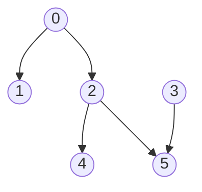
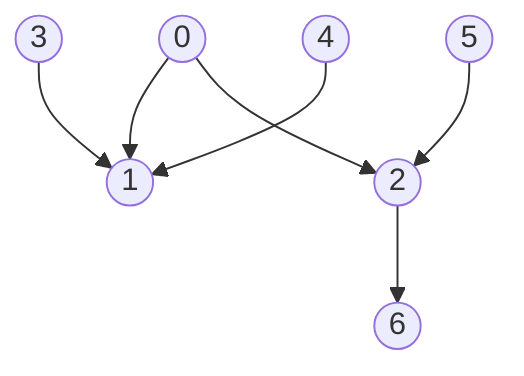

# DirectedTreeTest

```mermaid
graph TD
    0((0))
    1((1))
    2((2))
    3((3))
    4((4))
    5((5))
    0 --> 1
    0 --> 2
    2 --> 4
    2 --> 5
    3 --> 5
```

```mermaid
graph TD
    0((0))
    1((1))
    2((2))
    3((3))
    4((4))
    5((5))
    6((6))
    0 --> 1
    0 --> 2
    3 --> 1
    4 --> 1
    5 --> 2
    2 --> 6
```
