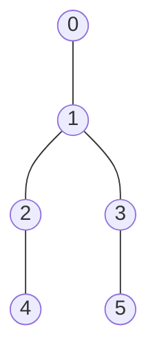
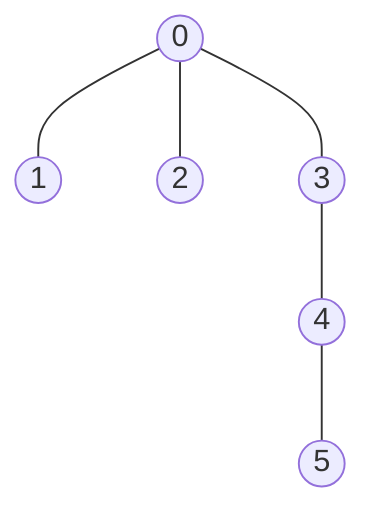
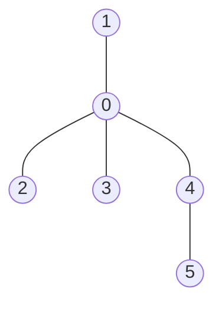
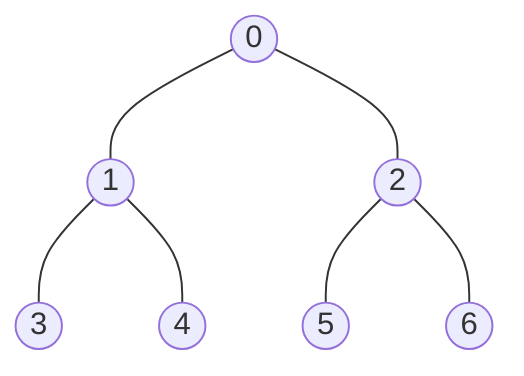

# UndirectedTreeTest

6-1

```mermaid
graph TD
    0((0))
    1((1))
    2((2))
    3((3))
    4((4))
    5((5))
    0 --- 1
    1 --- 2
    1 --- 3
    2 --- 4
    3 --- 5
```

6-2

```mermaid
graph TD
    0((0))
    1((1))
    2((2))
    3((3))
    4((4))
    5((5))
    0 --- 1
    0 --- 2
    0 --- 3
    3 --- 4
    4 --- 5
```

6-3

```mermaid
graph TD
    0((0))
    1((1))
    2((2))
    3((3))
    4((4))
    5((5))
    1 --- 0
    0 --- 2
    0 --- 3
    0 --- 4
    4 --- 5
```

7-1

```mermaid
graph TD
    0((0))
    1((1))
    2((2))
    3((3))
    4((4))
    5((5))
    6((6))
    0 --- 1
    0 --- 2
    1 --- 3
    1 --- 4
    2 --- 5
    2 --- 6
```
